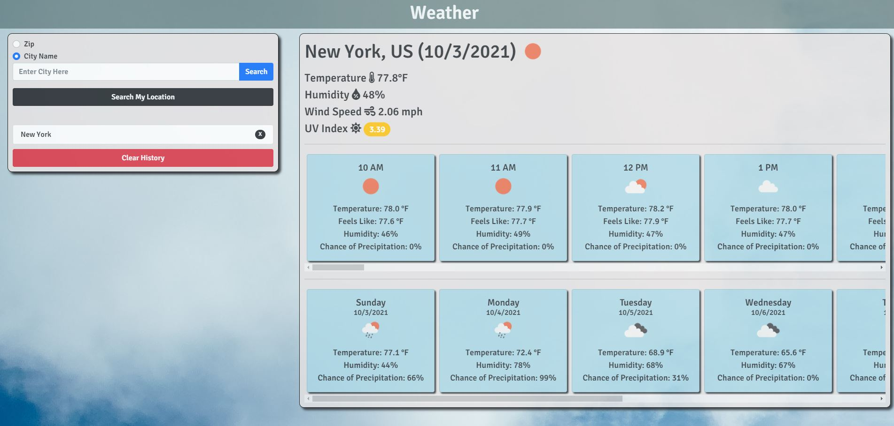

# React Weather APP

Click [here](https://maxx105.github.io/react_weather/) to open deployed Github pages application.

## Description 
This is a simple weather app that is built using React. 

## Table of Contents 
* [Technologies](#Technologies)
* [Usage](#Usage)
* [License](#License)
* [Badges](#Badges)
* [Tests](#Tests)
* [Questions](#Questions)

## Technologies 
* This application is written using the React.js javascript framework as well as JSX.
* It uses Axios for API Calls.
* It uses CSS/Bootstrap for styling.
* API's used were:
    - https://openweathermap.org/api for weather data
    - https://api.ipify.org to get device's IP
    - https://freegeoip.app to get location based on IP

## Usage 
If using from the Github pages deployed application, just go to the deployed application's [link](https://maxx105.github.io/react_weather/). To use, simply select either 'Zip' or 'City Name' to search by zip code or city name, respectively. You can also click the 'Search My Location' button to get a location based on your device's IP address. You will get a current weather reading as well as an hourly and daily forecast. It will also save your search history to your local storage so that you can quickly get weather for previous searches.

## License 
 MIT

## Badges 
 
 

## Tests 
 No tests are currently in place for this project.

## Questions 
 For any questions, contact me at [maxxsanner105@gmail.com](mailto:maxxsanner105@gmail.com).
#### 

